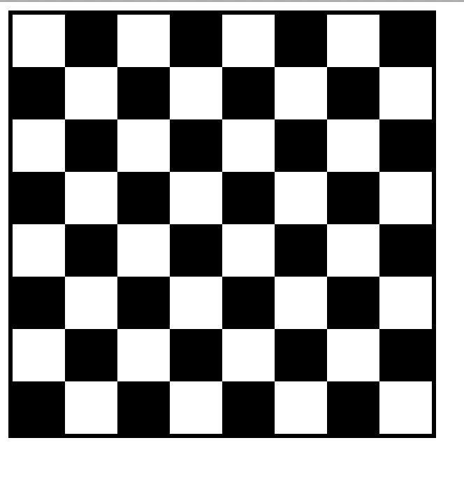

# Chessboard Using JS DOM

Aplikasi ini merupakan aplikasi untuk menampilkan papan catur yang dibuat menggunakan JavaScript DOM dengan menggunakan createElement untuk setiap baris dan kolom nya.

# Cara menjalankan aplikasi
1. Buka halaman index.html
2. Liat hasil dari menggunakan JS DOM
